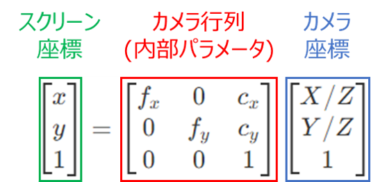
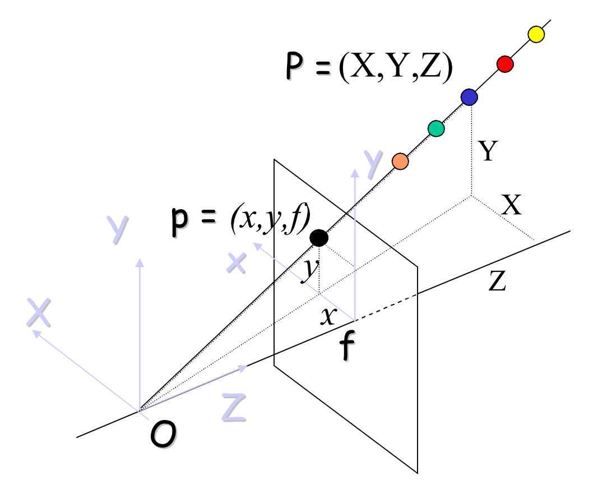

# ステレオカメラとは

　**カメラを2個組み合わせる**事で、通常のカメラのような平面的な画像だけでなく、**奥行き方向の距離も測定できるカメラ**を、「**ステレオカメラ**」と呼びます。

　人間の眼もステレオカメラと同様の原理で距離を知覚している（いわゆる「立体視」）ため、距離も含めた視覚が必要となる高度な用途、例えば自動運転や検査等でよく利用されます。

　このように産業用途でのニーズが極めて高いステレオカメラですが、その原理や実装法を日本語で体系的に紹介している書籍・記事がほとんどなく、学習に非常に苦労したので、備忘録も兼ねて記事にまとめたいと思います。

　本記事では主に理論面を紹介するので、OpenCVによる実装は以下を参照ください。

# 前提知識

## カメラ関係
カメラで撮影した画像をモデル化する方法について解説します

### ピンホールカメラモデル
[参考](https://cvml-expertguide.net/terms/cv/camera-geometry/camera-model/)

カメラにより実世界を画像として捉える仕組みは、一般的に以下の「ピンホールカメラモデル」によりモデル化されます。


#### 実際のカメラとレンズ
上記モデルをそのまま現実世界に構築したカメラが、[ピンホールカメラ](https://ja.wikipedia.org/wiki/%E3%83%94%E3%83%B3%E3%83%9B%E3%83%BC%E3%83%AB%E3%82%AB%E3%83%A1%E3%83%A9)である。画像平面上にフィルムやCMOSセンサのような光量を測定できる機構を設置することで、像を画像として保存できる。

ただし、ピンホールカメラは小さな穴からしか光を得られないため、**画像が暗く取得に時間が掛かる**（数秒～数時間）事が難点である。

そこで下図のように、**開口面を大きくしつつ、ピンホールカメラモデルと同様に画像平面上に光を集める**作用を持つ**レンズ**を用いることで、高速撮像を実現できる


レンズを使用した場合も、原理上はピンホールカメラモデルで実世界（物体）と像の関係を記述できる。

ただし、現実のレンズは[後述の画像の歪み]()を発生させるため、ステレオカメラのような精密測定用途では補正が必要となる。
また理想上はピンホールカメラモデルのピンホール位置とレンズの中心は一致するが、現代のカメラレンズは複数枚を組み合わせて使用することが一般的なため、ピンホール位置に相当する仮想上の点がレンズメーカーから指定されている事が多い。

### 透視投影モデル

上記ピンホールカメラは、**画像平面と像の向きが反転**してしまうため、直観上分かりづらい

そこで、実際に画像が結像されるカメラ後方ではなく、**カメラ前方に仮想的な結像位置**（[先ほどの図の]()「仮想画像」で示した位置）を設け、ここを画像平面とみなす「透視投影モデル」が、実用上よく利用される


### 座標変換

**画像内での座標**（左上から見て縦横方向何ピクセル目に写っているか）と、**実世界での座標**（ある点を原点としてxyz方向に何mmの位置にあるか）を**変換**できれば、**カメラに写った位置から実世界での座標を推定**できる


[上記の図](https://dev.classmethod.jp/articles/convert-coords-screen-to-space/)でいうと、

**画像内での座標**: **スクリーン座標** (ピクセル単位)
**実世界での座標**: **カメラ座標、ワールド座標** (mm単位)

カメラ座標系とワールド座標系の違いは以下となる

**カメラ座標**: カメラレンズの中心を原点とし、前方向をZ軸とする
**ワールド座標**: 任意の位置を原点とし、任意の方向に軸を設定できる

## 数学関係
上記で紹介した各種座標同士の変換は、基本的に行列を用いて計算します。

その中でも後述の[8点アルゴリズム]()や[基本行列Eの分解]()において重要となる、行列積、固有値分解、特異値分解について紹介します。

### 行列同士の積

```math
行列\boldsymbol{X} = 
\left(
\begin{array}{ccc}
 x_{11} & \ldots & x_{1m}\\
\vdots & \ddots & \vdots \\
x_{N1} & \ldots & x_{Nm}
\end{array}
\right)\\
行列\boldsymbol{W} = 
\left(
\begin{array}{ccc}
 w_{11} & \ldots & w_{1n}\\
\vdots & \ddots & \vdots \\
w_{m1} & \ldots & w_{mn}
\end{array}
\right)
```

としたとき、両者の積は行列で表せ、

```math
\boldsymbol{X}\boldsymbol{W} = 
\left(
\begin{array}{ccc}
 \sum_{i=1}^m x_{1i} w_{i1} & \ldots & \sum_{i=1}^m x_{1i} w_{in}\\
\vdots & \ddots & \vdots \\
\sum_{i=1}^m x_{Ni} w_{i1} & \ldots & \sum_{i=1}^m x_{Ni} w_{in}
\end{array}
\right)
```
のように計算できます。

例えば[後述のカメラ行列の式]()は、

```math
\begin{bmatrix} x \\ y \\ 1  \end{bmatrix}
= \begin{bmatrix} f_x & 0 & c_x \\ 0 & f_y & c_y \\ 0 & 0 & 1  \end{bmatrix}
\begin{bmatrix} X/Z \\ Y/Z \\ 1  \end{bmatrix}\\
= \begin{bmatrix} f_xX/Z + c_x \\ f_yY/Z + c_y \\ 1  \end{bmatrix}
```

のように計算できます。

### 固有値分解
行列Aが正則 (det(A)≠0)のとき、Aは以下のように変形する事ができます ([参考](https://kleinblog.net/eigenvalue-decomposition.html))

```math
\boldsymbol{P}^{-1}\boldsymbol{A}\boldsymbol{P} = \boldsymbol{\Lambda}\\
{\left\{\begin{array}{ll}
\boldsymbol{P}: \boldsymbol{A}の固有ベクトルを縦に並べたもの\\
\boldsymbol{\Lambda}: \boldsymbol{A}の固有値を対角成分に並べた対角行列
\end{array}\right.
}
```

また左右から$\boldsymbol{P}と\boldsymbol{P}^{-1}$ を掛けて

```math
\boldsymbol{A} = \boldsymbol{P}\boldsymbol{\Lambda}\boldsymbol{P}^{-1}
```

とも表せます

#### 固有値分解の計算方法

例えば、

```math
\boldsymbol{A}
= \begin{bmatrix} a_{11} & a_{12} & a_{13} \\ a_{21} & a_{22} & a_{23} \\ a_{31} & a_{32} & a_{33} \end{bmatrix}
```

とすると、[固有方程式](https://oguemon.com/study/linear-algebra/characteristic-equation/)

```math
|\boldsymbol{A} - \lambda\boldsymbol{E}|
= \begin{bmatrix} a_{11}-\lambda & a_{12} & a_{13} \\ a_{21} & a_{22}-\lambda & a_{23} \\ a_{31} & a_{32} & a_{33}-\lambda \end{bmatrix}=0
```

から固有値$\lambda$ を求める
[サラスの公式](https://mathlandscape.com/sarrus-rule/)より

```math
|\boldsymbol{A} - \lambda\boldsymbol{E}|= (a_{11}-\lambda)(a_{22}-\lambda)(a_{33}-\lambda) + a_{12}a_{23}a_{31} + a_{13}a_{21}a_{32} - a_{11}a_{23}a_{32} - a_{12}a_{21}a_{33} - a_{13}a_{22}a_{31}=0
```

となるので、このλの3次方程式を解いて得られた3解$\lambda_1,\lambda_2,\lambda_3$ がAの固有値となる。

さらに、

```math
\boldsymbol{A}\boldsymbol{x} = \lambda\boldsymbol{x}\\
\Leftrightarrow (\boldsymbol{A} - \lambda\boldsymbol{E})\boldsymbol{x} = \boldsymbol{0}
```

を満たすベクトル$\boldsymbol{x}$ が固有ベクトルとなるので、$\lambda_1,\lambda_2,\lambda_3$ をそれぞれλに代入して、固有ベクトル$\boldsymbol{x_1},\boldsymbol{x_2},\boldsymbol{x_3}$ を別個に求める
(固有ベクトルは定数倍しても上記条件を満たすため、スケールを統一するためにノルム$||\boldsymbol{x_i}||=1$ を満たすようそれぞれ正規化しておく)

これにより、求めた固有ベクトルと固有値を用いて

```math
\boldsymbol{P} = (\boldsymbol{x_1},\boldsymbol{x_2},\boldsymbol{x_3}) \cdots 固有ベクトルを並べた行列\\
\boldsymbol{\Lambda}
= \begin{bmatrix} \lambda_1 & 0 & 0 \\ 0 & \lambda_2 & 0 \\ 0 & 0 & \lambda_3 \end{bmatrix} \cdots 固有値を斜めに並べた行列
```
となる。

```math
\boldsymbol{\Lambda} = \boldsymbol{P}^{-1}\boldsymbol{A}\boldsymbol{P}
```

は対角成分以外が0となるので、固有値分解は「対角化」とも呼ばれます。
行列をシンプルな形に変形することができるため、行列のn乗や微分方程式の計算等多くの用途に用いられます。

### 特異値分解
固有値分解は正則な正方行列のみ定義できましたが、正方行列でない行列 (列数と行数が異なる。例えば[8点アルゴリズムの]()行列$\boldsymbol{A}$ )であっても、「特異値分解」と呼ばれる方法で以下のように分解する事ができます。

```math
\boldsymbol{A} = \boldsymbol{U}\boldsymbol{\Sigma}\boldsymbol{V}^T\\
{\left\{\begin{array}{ll}
\boldsymbol{U}: \boldsymbol{A}\boldsymbol{A}^Tの固有ベクトルを列ベクトルとして並べた行列 (直交行列となる)\\
\boldsymbol{\Sigma}: \boldsymbol{\Sigma}\boldsymbol{\Sigma}^Tは\boldsymbol{A}\boldsymbol{A}^Tの固有値を並べた対角行列\\
\boldsymbol{V}: \boldsymbol{A}^T\boldsymbol{A}の固有ベクトルを列ベクトルとして並べた行列 (直交行列となる)
\end{array}\right.
}
```

図で表すと以下のようになります ([画像出典](https://nisshingeppo.com/ai/singular-value-decomposition/), $n\leq m$ を前提とする)


特異値分解の肝になるのは、分解対象の行列Aとその転置行列との積 $\boldsymbol{A}\boldsymbol{A}^Tおよび\boldsymbol{A}^T\boldsymbol{A}$です。

元の行列Aがn×m行列で列数と行数が異なっていたとしても、転置行列との積をとる事で、$\boldsymbol{A}\boldsymbol{A}^T$ はn×n行列、$\boldsymbol{A}^T\boldsymbol{A}$ はm×m行列と、いずれも正方行列に変換する事ができます。

#### 特異値分解が成立する理由

$\boldsymbol{A}\boldsymbol{A}^T$ の固有ベクトルを$\boldsymbol{u_1},\cdots,\boldsymbol{u_n}$ とし、固有値を$\lambda_1,\cdots,\lambda_n$ とすると、 
(固有ベクトルは正規直交系となるよう、$||\boldsymbol{u_i}||=1$ となるよう正規化しておく)

```math
(\boldsymbol{A}\boldsymbol{A}^T)\boldsymbol{u_i} = \lambda_i\boldsymbol{u_i}
```

が成り立つ。
これを下図のように$\boldsymbol{U} = (\boldsymbol{u_1},\cdots,\boldsymbol{u_n})$ として行列演算にまとめ、


```math
(\boldsymbol{A}\boldsymbol{A}^T)\boldsymbol{U} = 
\boldsymbol{U}
\begin{bmatrix} \lambda_1 & \cdots & 0 \\ \vdots & \ddots & \vdots \\ 0 & \cdots & \lambda_n  \end{bmatrix}
```

が成り立つ。

$\sigma_i=\sqrt{\lambda_i}$ と置いて

```math
\boldsymbol{\Sigma} = \begin{bmatrix} \sigma_1 & \cdots & 0 & 0 & \cdots & 0 \\ \vdots & \ddots & \vdots & \vdots & \ddots & \vdots \\ 0 & \cdots & \sigma_n & 0 & \cdots & 0 \end{bmatrix}
```

とおくと

```math
\boldsymbol{\Sigma}\boldsymbol{\Sigma}^T=
\begin{bmatrix} \lambda_1 & \cdots & 0 \\ \vdots & \ddots & \vdots \\ 0 & \cdots & \lambda_n  \end{bmatrix}
```

となるので、先ほどの行列演算に代入して

```math
(\boldsymbol{A}\boldsymbol{A}^T)\boldsymbol{U} = 
\boldsymbol{U}(\boldsymbol{\Sigma}\boldsymbol{\Sigma}^T)
```


ここで、転置との積$\boldsymbol{A}\boldsymbol{A}^T$ は[実対称行列]()となり、[実対称行列の固有ベクトルは直交し](https://www.momoyama-usagi.com/entry/math-linear-algebra17#1-2)、かつ固有ベクトル$\boldsymbol{u_i}$ は[先ほど正規化している]()ので、正規直交基底である$\boldsymbol{u_i}$ を行ベクトルとして並べた$\boldsymbol{U}$ は[直交行列となる](https://manabitimes.jp/math/1218)。

よって$\boldsymbol{U}^T=\boldsymbol{U}^{-1}$ が成り立ち、$\boldsymbol{U}$ を両辺の右側から掛けて

```math
\boldsymbol{A}\boldsymbol{A}^T = 
\boldsymbol{U}^T\boldsymbol{\Sigma}\boldsymbol{\Sigma}^T\boldsymbol{U}
```

同様に$\boldsymbol{A}^T\boldsymbol{A}$ の固有ベクトルを$\boldsymbol{v_1},\cdots,\boldsymbol{v_m}$ とし、これらを列ベクトルとして並べた$\boldsymbol{V} = (\boldsymbol{v_1},\cdots,\boldsymbol{v_m})$ は

```math
\boldsymbol{A}^T\boldsymbol{A} = 
\boldsymbol{V}^T\boldsymbol{\Sigma}^T\boldsymbol{\Sigma}\boldsymbol{V} \cdots 式1
```

を満たします ($\boldsymbol{\Sigma}^T\boldsymbol{\Sigma}$ の内訳については[後述]())

$\boldsymbol{U}$ は[直交行列](https://ja.wikipedia.org/wiki/%E7%9B%B4%E4%BA%A4%E8%A1%8C%E5%88%97)なので $\boldsymbol{U}^T\boldsymbol{U}=\boldsymbol{U}^{-1}\boldsymbol{U}=\boldsymbol{E}$ となるので、式1の$\boldsymbol{\Sigma}^Tと\boldsymbol{\Sigma}$ の間にこれを掛けて

```math
\boldsymbol{A}^T\boldsymbol{A} = 
\boldsymbol{V}^T\boldsymbol{\Sigma}^T\boldsymbol{U}^T\boldsymbol{U}\boldsymbol{\Sigma}\boldsymbol{V}\\
=(\boldsymbol{U}\boldsymbol{\Sigma}\boldsymbol{V})^T (\boldsymbol{U}\boldsymbol{\Sigma}\boldsymbol{V})
```

よって$\boldsymbol{A} = \boldsymbol{U}\boldsymbol{\Sigma}\boldsymbol{V}$ と表せる事がわかりました。

#### Vの具体的な計算法

$\boldsymbol{A}^T\boldsymbol{A}$ の固有ベクトル$\boldsymbol{v_1},\cdots,\boldsymbol{v_m}$ を求める際は、 

```math
\boldsymbol{\Sigma}^T\boldsymbol{\Sigma}
= \begin{bmatrix} \lambda_1 & \cdots & 0 & 0 & \cdots & 0 \\ \vdots & \ddots & \vdots & \vdots & \ddots & \vdots \\ 0 & \cdots & \lambda_n & 0 & \cdots & 0 \\
0 & \cdots & 0 & 0 & \cdots & 0 \\
\vdots & \ddots & \vdots & \vdots & \ddots & \vdots \\
0 & \cdots & 0 & 0 & \cdots & 0 \\
\end{bmatrix}
```

となる事を利用し、$i\leq nの部分は\boldsymbol{u_i}$ 算出時と同じ固有値$\lambda_i$ を用いて、$i>n$ の部分は固有値を0として固有ベクトルを求める事ができます。

#### 特異値分解とステレオカメラ

ステレオカメラにおいて、特異値分解は「1. 基礎行列Fの算出」「2. 基本行列Eの回転Rと並進tへの分解」という2つの重要操作において、**それぞれ異なる理由で重要な役割を果たします**

それぞれ解説します

##### 1. 基礎行列Fの算出 (8点アルゴリズム)

[後述の基礎行列Fの算出 (8点アルゴリズム)]()において

```math
(\boldsymbol{A}^T\boldsymbol{A}) \boldsymbol{f}=\lambda\boldsymbol{f}
```

という関係式を解く必要が生じます。
この式は[先ほどの「特異値分解が成立する理由」]()で登場した式

```math
(\boldsymbol{A}\boldsymbol{A}^T)\boldsymbol{u_i} = \lambda_i\boldsymbol{u_i}
```

とまさに同じ形となっているため、特異値分解によって解くことができます。

##### 2. 基本行列Eの回転Rと並進tへの分解

特異値分解によって得られる幾何的 (図形的)なメリットは、$\boldsymbol{U},\boldsymbol{V}$ が直交行列、$\boldsymbol{\Sigma}$ が対角行列というシンプルな形で表されることです。

[こちらの記事](https://qiita.com/c60evaporator/items/d53053358105b0117f2c)で述べたように、直交行列は「反転行列」と「回転行列」の積で表せ、対角行列は「拡大」の効果を持ちます。

この性質を用いることで、後述の[基本行列Eの回転Rと並進tへの分解]()に活用する事ができます。


# ステレオカメラの処理フロー

[参考](https://plainenglish.io/blog/the-depth-i-stereo-calibration-and-rectification-24da7b0fb1e0)

ステレオカメラで撮影した画像に以下手順で処理を加えることで、3D点群 (Point Cloud)を取得する事ができます。
(対応するOpenCVの関数名も記述します)


それぞれ解説を進めます

## 0. 外部パラメータ算出 (ワールド座標とカメラ座標の変換)

ワールド座標とカメラ座標の変換は、以下の**外部パラメータ**を推定することで実現できる


ステレオカメラでの距離画像算出に直接関連しないため詳細は触れないが、外部パラメータの働きは[こちらを参照](https://mem-archive.com/2018/02/17/post-74/)

OpenCVでは[SolvePnP()](https://docs.opencv.org/3.4/d9/d0c/group__calib3d.html#ga549c2075fac14829ff4a58bc931c033d)関数で外部パラメータを推定できる。ただしワールド座標を表すモックアップ的なものを実際に作ってカメラで写し、特徴点を抽出する必要があるので、手間が掛かります。

外部パラメータ行列

```math
\boldsymbol{T_w}
= \begin{bmatrix} r_{11} & r_{12} & r_{13} & t_x \\ r_{21} & r_{22} & r_{23} & t_y \\ r_{31} & r_{32} & r_{33} & t_z \end{bmatrix}
```

は、以下のように回転と並進に分ける事ができます

```math
\boldsymbol{R_w}
= \begin{bmatrix} r_{11} & r_{12} & r_{13} \\ r_{21} & r_{22} & r_{23} \\ r_{31} & r_{32} & r_{33} \end{bmatrix},
\boldsymbol{t_w}
= \begin{bmatrix} t_x \\ t_y \\ t_z \end{bmatrix}
```

```math
\begin{bmatrix} X \\ Y \\ Z  \end{bmatrix}
= \boldsymbol{R_w}
\begin{bmatrix} X_w \\ Y_w \\ Z_w \end{bmatrix}
+ \boldsymbol{t_w}
```


## 1. カメラ行列算出 (カメラ座標とスクリーン座標の変換)

カメラ座標(mm単位)とスクリーン座標(ピクセル単位)の変換は、以下の**カメラ行列**を推定することで実現できる (カメラ行列で変換できる理由は[こちら参照](https://mem-archive.com/2018/02/21/post-157/))



カメラ行列

```math
\boldsymbol{K}
=
\begin{bmatrix} f_x & 0 & c_x \\ 0 & f_y & c_y \\ 0 & 0 & 1  \end{bmatrix}
```

のパラメータはそれぞれ以下の意味を表す ([ピクセル単位となる理由はこちら参照](https://mem-archive.com/2018/02/25/post-201/))

```math
c_x: スクリーン座標におけるカメラ中心のx座標(ピクセル単位)\\
c_y: スクリーン座標におけるカメラ中心のy座標(ピクセル単位)\\
f_x: 焦点距離(ピクセル単位)\\
f_y: 焦点距離(ピクセル単位)
```

$c_x,c_y$はレンズとCMOS素子がきちんと組付けられていれば画像の中心のピクセル位置となり、$f_x,f_y$はレンズの焦点距離$f [mm] \div 素子サイズ [mm/pixel]$となるはずだが、実際は工作精度に起因するずれがあるため、以下のような**チェスボードパターン**を用いて複数点の位置関係を検出し、OpenCVの[calibrateCamera()](https://docs.opencv.org/3.4/d9/d0c/group__calib3d.html#ga3207604e4b1a1758aa66acb6ed5aa65d)関数でカメラ行列を求めます。


また、点の位置関係を取得するためのチェスボードのコーナー点検出は、OpenCVの[findChessboardCorners()](https://docs.opencv.org/4.x/d9/d0c/group__calib3d.html#ga93efa9b0aa890de240ca32b11253dd4a)関数を用います (ステレオカメラ固有というより純粋な画像処理に近いアルゴリズムのため、関数の具体内容は本記事では解説しません)

なお、ステレオカメラの場合は後述の`stereoCalibrate()`関数で左右それぞれのカメラのカメラ行列を求められるので、`calibrateCamera()`関数を実行する必要はありません。

#### ※カメラ行列と正規化画像座標

[前述のように]()、実際に像が結像されるのはカメラ座標の原点からf離れた位置であり、その対象位置に画像平面をおいてスクリーン座標を定義しました。

一方で、カメラ行列を扱う際は、下図のように**原点から距離1に仮想的な投影面**を置き、**視線と投影面との交点のカメラ座標**$\boldsymbol{p}=(X/Z,Y/Z,1)=(X_p,Y_p,1)$ を使用すると便利です。


ベクトル$\boldsymbol{p}=(X/Z,Y/Z,1)$ の式を見ると、カメラ行列によるスクリーン座標とカメラ座標の変換式

```math
\begin{bmatrix} x \\ y \\ 1  \end{bmatrix}
= \begin{bmatrix} f_x & 0 & c_x \\ 0 & f_y & c_y \\ 0 & 0 & 1  \end{bmatrix}
\begin{bmatrix} X/Z \\ Y/Z \\ 1  \end{bmatrix}
```

の右辺と$\boldsymbol{p}$ の式が一致し、スクリーン座標を$\boldsymbol{m} = (x,y,1)$ (最後の1は行列計算できるよう付加した便宜上の値)とすると

```math
\boldsymbol{m} = \boldsymbol{K} \boldsymbol{p} \cdots ①
```

という簡単な式で表せます。
($\boldsymbol{m}と\boldsymbol{p}$の転置を省略していますが、ご了承ください)

この$\boldsymbol{p}=(X_p,Y_p,1)$は、「**正規化画像座標**」とも呼ばれます。 ([参考](https://daily-tech.hatenablog.com/entry/2018/01/22/071346))

[後述のエピポーラ幾何]()でも、計算しやすいようこの原点から距離1の仮想的な投影面、すなわち正規化画像座標を使用します。

## 2. 歪みパラメータ算出

実際のレンズには以下のような画像の歪みが存在し、精度に悪影響を与える


上記`calibrateCamera()`関数ではこのレンズの歪みを補正するためのパラメータ (**歪みパラメータ**)を推定する機能も付いている。ここでは深くは触れないが、[こちら](https://kamino.hatenablog.com/entry/opencv_calibrate_camera#sec1)に詳細が記載されている。

「1. カメラ行列」と「2. 歪みパラメータ」を合わせて、**内部パラメータ**とも呼ぶ

### 【参考】内部パラメータの具体的な求め方

チェスボードを用いて内部パラメータ（カメラ行列＋歪みパラメータ）を求める手法はいくつか (["Tsai's method"](https://web.wakayama-u.ac.jp/~wuhy/CV11.pdf)等)存在するが、
代表的な手法として、**Zhang's method**が挙げられる。

OpenCVの`calibrateCamera()`関数でも、[この手法が採用されているようです](https://learnopencv.com/camera-calibration-using-opencv/)。

Zhang's methodは難解かつステレオカメラの原理と直接関連するものではないのでここでは紹介しませんが、興味がある方は以下を参照ください（機会があれば別途記事化します）

https://www.qoosky.io/techs/67a3d876c4

https://mphy0026.readthedocs.io/en/latest/calibration/camera_calibration.html

https://www.researchgate.net/profile/Wilhelm-Burger/publication/303233579_Zhang's_Camera_Calibration_Algorithm_In-Depth_Tutorial_and_Implementation/links/5eaad8c9a6fdcc70509c3c9b/Zhangs-Camera-Calibration-Algorithm-In-Depth-Tutorial-and-Implementation.pdf

## 3. ステレオカメラのキャリブレーション

ここまでは1台のカメラのみでの話でしたが、先ほどのカメラ行列の式

```math
\begin{bmatrix} x \\ y \\ 1  \end{bmatrix}
= \begin{bmatrix} f_x & 0 & c_x \\ 0 & f_y & c_y \\ 0 & 0 & 1  \end{bmatrix}
\begin{bmatrix} X/Z \\ Y/Z \\ 1  \end{bmatrix}
```

からも分かるように、奥行き方向の座標$Z$の値を変えると$X,Y$の組み合わせは無限に存在し、一意に座標を特定することができない。

以下の図（[出展](https://www.cse.psu.edu/~rtc12/CSE486/lecture08.pdf)）のように、画像上の点p（スクリーン座標、正規化画像座標どちらであっても）に映る現実世界の点は、色付きの点Pが示すように複数存在するからである。



上記の**奥行き方向の座標を求めるため、2台のカメラ**を組み合わせた「**ステレオカメラ**」がよく利用されます。

下図のように、2台目のカメラの画像上のどの位置に点が映るかで、現実世界の点Pの位置を一意に特定できます。


一方で、**左右のカメラの位置関係**（ステレオカメラにおける「**外部パラメータ**」あるいは「[**基本行列**]()」と呼ばれる）が分からないと拘束条件として機能しないため、まずはこの位置関係を求める「ステレオカメラのキャリブレーション」を、OpenCVの[`stereoCalibrate()`関数](https://docs.opencv.org/4.x/d9/d0c/group__calib3d.html#ga9d2539c1ebcda647487a616bdf0fc716)を使って求めます。

`stereoCalibrate()`関数使用時は、以下のように**同じチェスボードパターンを2台のカメラで同時撮影**する必要があります。


`stereoCalibrate()`関数で求まる左右のカメラの位置関係は、

- 左右のカメラの角度差を表す回転行列$\boldsymbol{R}$
- 左右のカメラの水平位置の差を表す並進ベクトル$\boldsymbol{t}$

で表され（$\boldsymbol{R}と\boldsymbol{t}$ をまとめたものが[後述の基本行列]()$\boldsymbol{E}$ ）、2台のカメラ座標は以下のように変換できる

```math
\begin{bmatrix} X_2 \\ Y_2 \\ Z_2 \\ 1 \end{bmatrix} = \begin{bmatrix} \boldsymbol{R} & \boldsymbol{t} \\ 0 & 1 \end{bmatrix} \begin{bmatrix} X_1 \\ Y_1 \\ Z_1 \\ 1 \end{bmatrix}
```

なお、回転行列Rは様々な表現方法があるので、[こちら](http://www.info.hiroshima-cu.ac.jp/~miyazaki/knowledge/tech0007.html)を参照してください。

また併進ベクトル$\boldsymbol{t}$は以下の式で表されます (カメラ座標なので各要素はmm単位)

```math
\boldsymbol{t}=\begin{bmatrix} T_x \\ T_y \\ T_z \end{bmatrix}
```

`stereoCalibrate()`関数はチェスボードパターンを写しているので、左右それぞれのカメラの「1.カメラ行列」「2.歪みパラメータ」も同時に求める事ができます。

[公式ドキュメント](https://docs.opencv.org/3.4/d9/d0c/group__calib3d.html#ga91018d80e2a93ade37539f01e6f07de5)によると、求まったパラメータや行列はそれぞれ以下の変数に格納されます

|変数名|内容|
|---|---|
|R|左右のカメラの角度差を表す回転行列$\boldsymbol{R}$|
|T|左右のカメラの水平位置の差を表す並進ベクトル$\boldsymbol{t}$|
|cameraMatrix1|カメラ1のカメラ行列$\boldsymbol{K}$|
|distCoeffs1|カメラ1の歪みパラメータ|
|cameraMatrix2|カメラ2のカメラ行列$\boldsymbol{K'}$|
|distCoeffs2|カメラ2の歪みパラメータ|
|E|[後述の]()基本行列$\boldsymbol{E}$|
|F|[後述の]()基礎行列$\boldsymbol{F}$|

※左右のカメラどちらをカメラ1としてもよいが、左側カメラを1とする事が多い

ただキャリブレーションするだけなら上記のようにOpenCVを用いれば実現できてしまいますが、
**RとTを具体的にどのように求めているか**分からないと「完全に理解」とは言えないので、以下で詳細解説します。

### 【参考】 エピポーラ幾何

`stereoCalibrate()`関数でRとTを求めるためには、カメラ1とカメラ2の**スクリーン座標同士の関係式**を理解する必要があります。

変換式は「エピポーラ幾何」と呼ばれる方法で求められます。少し複雑なので、厳密な理解を求めない方は読み飛ばしても良いですが、数式で論理の飛躍のないよう理解したい方はぜひ読んで頂きたいです。

#### エピポーラ幾何

[参考1](https://qiita.com/Thought_Nibbler/items/9cb7c2637000eecc1a30)
[参考2](https://web.stanford.edu/class/cs231a/course_notes/03-epipolar-geometry.pdf)

[前述のように]()、エピポーラ幾何では計算しやすいよう、原点から1離れた位置に仮想的な画像平面（正規化画像座標）を置いて拘束関係を考えます。

下図のように、実世界の点Pをカメラ1と2で写した際に、それぞれの視線が画像平面と交わる点（正規化画像座標）を$\boldsymbol{p}(X_p,Y_p,1),\boldsymbol{p'}(X_p',Y_p',1)$ とします。

($\boldsymbol{p}$ はカメラ1のカメラ座標、$\boldsymbol{p'}$はカメラ2のカメラ座標と同じ座標系で表される)


次に、**カメラ1に点pが映っているとき、対応する現実世界での点Pがカメラ2にどのように映るか**、すなわち点p'の位置の候補**について考える**。

以下の図のように、Pの位置の候補は直線C-p上に並ぶため、この直線C-pがカメラ2に投影された直線、すなわちC',C,pを結んだ面（エピポーラ面）とカメラ2の画像平面とが交わってできる直線が、p'の位置の候補となる。

この**p'の位置の候補となる直線**を、「**エピポーラ線**」と呼ぶ。


なお、カメラ1の原点Cとカメラ2の原点C'を結んだ直線と、カメラ1,2の画像平面とが交わる点e, eを「エピポール」と呼び、全てのエピポーラ線はエピポールを通る。

上記のようなモデルを「**エピポーラ幾何**」と呼ぶ。

このエピポーラ幾何に基づきpとp'の関係を求め、回転行列Rと並進行列tを求めるが、**エピポーラ幾何は3次元のカメラ座標上で定義される**のに対し、**実際に得られるデータはカメラ1と2に映った2次元の画像=スクリーン座標**なので、以下の3種類の拘束関係を組み合わせて適用する必要がある


図中に

- エピポーラ拘束
- 基本行列
- 基礎行列

という単語が出てきましたが、順を追って解説を進めます。

#### エピポーラ拘束

「**p'がエピポーラ線上にある**」という条件を、「**エピポーラ拘束**」と呼び、2台のカメラで同一物体を写した場合、常にこの条件を満たす。
よって、この「エピポーラ拘束」を**数式で表して現実の画像と比べる**ことで、両カメラの位置関係、すなわち$行列\boldsymbol{R}とベクトル\boldsymbol{t}$を求める事ができる。

ここからは、**カメラ2のカメラ座標系**$(X_2,Y_2,Z_2)$でエピポーラ拘束を数式表現していく。

エピポーラ線の方程式を$aX_2+bY_2+c=0$ とし、係数ベクトル$(a,b,c)=\boldsymbol{l}$ とすると、

冒頭の「$\boldsymbol{p'}=(X_p',Y_p',1)$がエピポーラ線上にある」

は、以下のように言い換えられる (エピポーラ線の方程式を$\boldsymbol{p'}=(X_p',Y_p',1)$が満たす)

```math
\Leftrightarrow \boldsymbol{p'} \cdot \boldsymbol{l}=aX_p'+bY_p'+c=0 \cdots ②
```

この式は「$\boldsymbol{p'}と\boldsymbol{l}$の内積=0」を意味するので、以下のように言い換えられる。

```math
\Leftrightarrow \boldsymbol{p'} と \boldsymbol{l}は常に垂直である
```

$\boldsymbol{p'}$ はカメラ2の画像とカメラ行列から既知なので、この条件を満たすベクトル$\boldsymbol{l}$ の必要十分条件を求める必要がある。

下図のように、ベクトル$\boldsymbol{p'}$のとりうる範囲はエピポーラ面上に並ぶので、これらと常に垂直となる条件は、

```math
\Leftrightarrow エピポーラ面とベクトル\boldsymbol{l}が垂直である
```

となる


ベクトル$\boldsymbol{l}$とある面が垂直である条件は、[外積の定義](https://www.headboost.jp/cross-product/)から

「その面を張る2本のベクトルの外積が$\boldsymbol{l}$と一致する」

事となる。
よって、エピポーラ面を張る2本のベクトルとして、既に定義した変数のみで表現できる下図の2ベクトル$\boldsymbol{R}\boldsymbol{p}$ および$\boldsymbol{t}$ を採用すると、両者の外積を利用して


```math
\Leftrightarrow \boldsymbol{l} = \boldsymbol{t} \times \boldsymbol{R} \boldsymbol{p}
```

となる。
(※ベクトル$\boldsymbol{p}$ をカメラ1からカメラ2の座標に変換する際に回転$\boldsymbol{R}$ のみ考慮し並進ベクトル$\boldsymbol{t}$ を考慮していないが、これはベクトルは方向のみを表し絶対位置の情報は保持しないので、並進に対して不変だからである)

これを②に代入して、

```math
\boldsymbol{p'} \cdot (\boldsymbol{t} \times \boldsymbol{R} \boldsymbol{p}) = 0 \cdots ③
```

となる。
この式が、エピポーラ拘束を定式化したものとなり、カメラ1に写った点$\boldsymbol{p'}$と、カメラ2に写った点$\boldsymbol{p}$の拘束関係を数式で表現できた事が分かる。

#### 基本行列

上記では外積$\boldsymbol{t} \times \boldsymbol{R} \boldsymbol{p}$を用いているが、外積をそのまま利用すると計算上扱いづらいので、$\boldsymbol{t}=(T_x,T_y,T_z)$との外積を代用できる交代行列([参考](https://qiita.com/kodai100/items/5e61022a19c13a841d1d))

```math
[\boldsymbol{t_{\times}}]
=
\begin{bmatrix} 0 & -T_z & T_y \\ T_z & 0 & -T_x \\ -T_y & T_x & 0 \end{bmatrix}
```

を用いて、③を書き換えて

```math
\boldsymbol{p'} \cdot ([\boldsymbol{t_{\times}}] \boldsymbol{R} \boldsymbol{p}) = 0
```

ベクトルの内積を行列表記に書き換えて ([こちらの「内積の定義（2-1）」参照](https://k-san.link/inner-product/))

```math
\boldsymbol{p'}^T [\boldsymbol{t_{\times}}] \boldsymbol{R} \boldsymbol{p} = 0
```

$\boldsymbol{E}=[\boldsymbol{t_{\times}}] \boldsymbol{R}$とおくと、

```math
\boldsymbol{p'}^T \boldsymbol{E} \boldsymbol{p} = 0 \cdots ④
```

この$\boldsymbol{E}=[\boldsymbol{t_{\times}}] \boldsymbol{R}$を「**基本行列**」(Essential matrix)と呼び、カメラ1とカメラ2の位置関係を包括的に表せる便利な行列となります。

##### ※基本行列のランク

$[\boldsymbol{t_{\times}}]$の列ベクトルをそれぞれ

```math
\boldsymbol{a}
=
\begin{bmatrix} 0 \\ T_z \\ -T_y \end{bmatrix},
\boldsymbol{b}
=
\begin{bmatrix} -T_z \\ 0 \\ T_x \end{bmatrix},
\boldsymbol{c}
=
\begin{bmatrix} T_y \\ -T_x \\ 0 \end{bmatrix}
```

とすると、

```math
\boldsymbol{c} = -\frac{T_x}{T_z}\boldsymbol{a} - \frac{T_y}{T_z}\boldsymbol{b}
```

が成り立ち$\boldsymbol{c}$ は独立なベクトルではないと分かるので、$[\boldsymbol{t_{\times}}]$のランク=[独立な列ベクトルの本数](https://manabitimes.jp/math/1188)=2となる

また回転行列$\boldsymbol{R}$ は[行列式=1](https://ja.wikipedia.org/wiki/%E5%9B%9E%E8%BB%A2%E8%A1%8C%E5%88%97)で正則行列のため、$[\boldsymbol{t_{\times}}]$ に正則行列を掛けた$\boldsymbol{E}$ も[ランクは変わらず](http://risalc.info/src/rank-matrix.html#inv)2となる。

#### 基礎行列

基礎行列$\boldsymbol{E}$によりカメラ1とカメラ2の位置関係を数式で表現できるようになりましたが、これはあくまでカメラ座標での話です。

実際に得られるのはカメラ1とカメラ2で撮影した画像 (スクリーン座標)なので、カメラ座標での関係を両スクリーン座標での関係に変換する必要があります。


[前述の式①]()より、$\boldsymbol{p}=(X_p,Y_p,1)$ とカメラ1のスクリーン座標$\boldsymbol{m} = (x_p,y_p,1)$ はカメラ1のカメラ行列$\boldsymbol{K}$ を用いて以下の関係で表される

```math
\boldsymbol{m} = \boldsymbol{K_1} \boldsymbol{p}\\
\Leftrightarrow \boldsymbol{p} = \boldsymbol{K}^{-1} \boldsymbol{m}
```

同様にカメラ2に関しても、カメラ2のカメラ行列$\boldsymbol{K'}$ を用いて

```math
\boldsymbol{m'} = \boldsymbol{K'} \boldsymbol{p'}\\
\Leftrightarrow \boldsymbol{p'} = \boldsymbol{K'}^{-1} \boldsymbol{m'}
```

が成り立ち、これらを式④に代入して ([積の転置](https://risalc.info/src/transpose-matrix-properties.html#prod)を適用)

```math
\boldsymbol{m'}^T (\boldsymbol{K'}^{-1})^T \boldsymbol{E} \boldsymbol{K}^{-1} \boldsymbol{m} = 0
```

$\boldsymbol{F}=(\boldsymbol{K'}^{-1})^T \boldsymbol{E} \boldsymbol{K}^{-1}$・・⑤とおくと、

```math
\boldsymbol{m'}^T \boldsymbol{F} \boldsymbol{m} = 0 \cdots ⑥
```

この$\boldsymbol{F}=(\boldsymbol{K'}^{-1})^T \boldsymbol{E} \boldsymbol{K}^{-1}$を「**基礎行列**」(Fundamental matrix)と呼び、カメラ1とカメラ2の画像 (スクリーン座標)同士の関係を表す行列となります。

**基本行列、基礎行列**どちらも2カメラの関係を数式で記述できる行列となりますが、**違いを一言で述べる**と以下のようになります。

- **基本行列: 2カメラの位置関係(外部パラメータ)のみを考慮**
- **基礎行列: 2カメラの位置関係(外部パラメータ)＋内部パラメータを考慮**

なお、ここで述べた基礎行列は内部パラメータとしてカメラ行列$\boldsymbol{K}$のみを考慮していますが、OpenCVでは[歪パラメータ]()も考慮して計算を行うことが可能です。

##### ※基礎行列のランク

カメラ行列

```math
\boldsymbol{K}
=
\begin{bmatrix} f_x & 0 & c_x \\ 0 & f_y & c_y \\ 0 & 0 & 1  \end{bmatrix}
```

に[サラスの公式](https://mathlandscape.com/sarrus-rule/)を適用すると、$\boldsymbol{K}の行列式=f_xf_y\neq0$ となり、$\boldsymbol{K}$ およびその逆行列、転置は正則行列である事が分かる。(逆行列が存在する時点で正則ですが…)

よってランク2の基本行列$\boldsymbol{E}$ に正則行列$(\boldsymbol{K'}^{-1})^T,\boldsymbol{K}^{-1}$ を掛けた、基礎行列

```math
\boldsymbol{F}=(\boldsymbol{K'}^{-1})^T \boldsymbol{E} \boldsymbol{K}^{-1}
```

も[ランクは変わらず](http://risalc.info/src/rank-matrix.html#inv)2となります。

###  【参考】 ステレオカメラのキャリブレーション方法

2台のカメラで撮影したチェスボードとエピポーラ幾何に基づきRとtを求めるには、以下の手順をとります
(OpenCVの`stereoCalibrate()`関数も、基本的には同じ方法をとっているはずです)


それぞれ解説します

#### ①基礎行列Fの算出 (8点アルゴリズム)

Fを求める方法はいくつかあるが、シンプルな方法として[8点アルゴリズム](https://web.stanford.edu/class/cs231a/course_notes/03-epipolar-geometry.pdf) (The Eight-Point Algorithm)が挙げられます。

##### ・8点アルゴリズムの基本的な考え方

カメラ1とカメラ2の画像座標 (スクリーン座標)

```math
\boldsymbol{m} = \begin{bmatrix} x_p \\ y_p \\ 1 \end{bmatrix}, \boldsymbol{m'} = \begin{bmatrix} x_p' \\ y_p' \\ 1 \end{bmatrix}
```

を式⑥に代入すると

```math
\boldsymbol{m'}^T \boldsymbol{F} \boldsymbol{m} = 0 \\

\Leftrightarrow \begin{bmatrix} x_p', & y_p', & 1 \end{bmatrix}
\begin{bmatrix} F_{11} & F_{12} & F_{13} \\ F_{21} & F_{22} & F_{23} \\ F_{31} & F_{32} & F_{33} \end{bmatrix}
\begin{bmatrix} x_p \\ y_p \\ 1 \end{bmatrix} = 0 \\

\Leftrightarrow x_px_p'F_{11} + y_px_p'F_{12} + x_p'F_{13} + x_py_p'F_{21} + y_py_p'F_{22} + y_p'F_{23} + x_pF_{31} + y_pF_{32} + F_{33} = 0 \\

\Leftrightarrow [x_px_p', y_px_p', x_p', x_py_p', y_py_p', y_p', x_p, y_p, 1]
\begin{bmatrix} F_{11} \\ F_{12} \\ F_{13} \\ F_{21} \\ F_{22} \\ F_{23} \\ F_{31} \\ F_{32} \\ F_{33} \end{bmatrix} = 0
```

よって、$\boldsymbol{m}と\boldsymbol{m'}$ の組み合わせを8通り、すなわち下図のように左右のカメラ画像中で対応する点を8組抽出できれば、


i点目の左右カメラでの画像座標 (スクリーン座標)を

```math
\boldsymbol{m_i} = \begin{bmatrix} x_i \\ y_i \\ 1 \end{bmatrix}, \boldsymbol{m_i'} = \begin{bmatrix} x_i' \\ y_i' \\ 1 \end{bmatrix}
```

として、

```math
\begin{bmatrix} x_1x_1' & y_1x_1' & x_1' & x_1y_1' & y_1y_1' & y_1' & x_1 & y_1 & 1 \\
x_2x_2' & y_2x_2' & x_2' & x_2y_2' & y_2y_2' & y_2' & x_2 & y_2 & 1 \\
x_3x_3' & y_3x_3' & x_3' & x_3y_3' & y_3y_3' & y_3' & x_3 & y_3 & 1 \\
x_4x_4' & y_4x_4' & x_4' & x_4y_4' & y_4y_4' & y_4' & x_4 & y_4 & 1 \\
x_5x_5' & y_5x_5' & x_5' & x_5y_5' & y_5y_5' & y_5' & x_5 & y_5 & 1 \\
x_6x_6' & y_6x_6' & x_6' & x_6y_6' & y_6y_6' & y_6' & x_6 & y_6 & 1 \\
x_7x_7' & y_7x_7' & x_7' & x_7y_7' & y_7y_7' & y_7' & x_7 & y_7 & 1 \\
x_8x_8' & y_8x_8' & x_8' & x_8y_8' & y_8y_8' & y_8' & x_8 & y_8 & 1
\end{bmatrix}
\begin{bmatrix} F_{11} \\ F_{12} \\ F_{13} \\ F_{21} \\ F_{22} \\ F_{23} \\ F_{31} \\ F_{32} \\ F_{33} \end{bmatrix} = 0
```

の連立方程式からFの係数を求められる。

##### ・特異値分解による精度UP

[参考](https://www.cse.psu.edu/~rtc12/CSE486/lecture20_6pp.pdf)

上記で用いる8点の座標は、[特徴点の検出]()誤差等のノイズをもち、これがFの推定制度を低下させます。

そこで実用上は精度を上げるため9点以上（点の個数をnとする）を用い、

```math
\begin{bmatrix} x_1x_1' & y_1x_1' & x_1' & x_1y_1' & y_1y_1' & y_1' & x_1 & y_1 & 1 \\
:\\
x_nx_n' & y_nx_n' & x_n' & x_ny_n' & y_ny_n' & y_n' & x_n & y_nn & 1
\end{bmatrix}
\begin{bmatrix} F_{11} \\ F_{12} \\ F_{13} \\ F_{21} \\ F_{22} \\ F_{23} \\ F_{31} \\ F_{32} \\ F_{33} \end{bmatrix} = 0
```

となるFの係数を求めます。上式のままでは変数の数よりも等式の数が多く、うまく解けないので、

```math
\boldsymbol{A}=
\begin{bmatrix} x_1x_1' & y_1x_1' & x_1' & x_1y_1' & y_1y_1' & y_1' & x_1 & y_1 & 1 \\
:\\
x_nx_n' & y_nx_n' & x_n' & x_ny_n' & y_ny_n' & y_n' & x_n & y_nn & 1
\end{bmatrix},
\boldsymbol{f}=
\begin{bmatrix} F_{11} \\ F_{12} \\ F_{13} \\ F_{21} \\ F_{22} \\ F_{23} \\ F_{31} \\ F_{32} \\ F_{33} \end{bmatrix}
```

とおいて、 (元の等式は$\boldsymbol{A}\boldsymbol{f}=0$ と表せる)

```math
||\boldsymbol{A}\boldsymbol{f}||^2 \cdots ⑦ \quad (ベクトル\boldsymbol{A}\boldsymbol{f}の各成分の二乗和)
```

を最小化する**f**を求める問題に変換します。

またこの条件のみでは$\boldsymbol{f}=\boldsymbol{0}$ という自明かつ無意味な解が求まってしまうため、**f**の各成分の二乗和を1に固定する

```math
||\boldsymbol{f}||=1 \cdots ⑧
```

という制約条件も加えます

ここで、ある列ベクトル$\boldsymbol{a}$ に対し

```math
||\boldsymbol{a}||^2=[a_1, a_2, \cdots, a_k]
\begin{bmatrix} a_1 \\ a_2 \\ : \\ a_k \end{bmatrix} = \boldsymbol{a}^T\boldsymbol{a}
```

が成り立ち、$\boldsymbol{A}\boldsymbol{f}$ も列ベクトルで同様の計算が成り立つので、

```math
||\boldsymbol{A}\boldsymbol{f}||^2 = (\boldsymbol{A}\boldsymbol{f})^T(\boldsymbol{A}\boldsymbol{f})\\
=\boldsymbol{f}^T\boldsymbol{A}^T\boldsymbol{A}\boldsymbol{f}
```

同様に$\boldsymbol{f}$ についても、

```math
||\boldsymbol{f}||^2 = \boldsymbol{f}^T \boldsymbol{f}
```

が成り立つので、⑦と⑧は以下の問題に整理できます

```math
\boldsymbol{f}^T \boldsymbol{f}-1=0の条件下で\\
\boldsymbol{f}^T\boldsymbol{A}^T\boldsymbol{A}\boldsymbol{f}を最小化
```

この問題に[ラグランジュの未定乗数法](https://manabitimes.jp/math/879) を適用すると、

```math
L(\boldsymbol{f},\lambda)=\boldsymbol{f}^T\boldsymbol{A}^T\boldsymbol{A}\boldsymbol{f}-\lambda(\boldsymbol{f}^T\boldsymbol{f}-1)
```

に対し、

```math
\frac{\partial L}{\partial \boldsymbol{f}}
=2\boldsymbol{A}^T\boldsymbol{A}\boldsymbol{f}-2\lambda\boldsymbol{f}=\boldsymbol{0} \cdots ⑨\\
\frac{\partial L}{\partial \lambda}
=\boldsymbol{f}^T\boldsymbol{f}-1=0 \cdots ⑩
```

が成り立つ。

⑨を変形して

```math
(\boldsymbol{A}^T\boldsymbol{A}) \boldsymbol{f}=\lambda\boldsymbol{f}
```

上式から、$\boldsymbol{f}$ は行列$\boldsymbol{A}^T\boldsymbol{A}$ の固有ベクトル、λは固有値となることが分かります。


また$\boldsymbol{A}^T\boldsymbol{A}$ の固有ベクトルは、上式が([前述の「ステレオカメラと特異値分解」]())と同じ形となっている事を利用して、$\boldsymbol{A}$ の特異値分解 

```math
\boldsymbol{A}=\boldsymbol{U} \boldsymbol{\Sigma} \boldsymbol{V}^T
```

の$\boldsymbol{U}$の列ベクトル

```math
\boldsymbol{U} = [\boldsymbol{u_1}, \boldsymbol{u_2}, \boldsymbol{u_3}]
```

のいずれかとして求める事ができます ([参考](https://qiita.com/kidaufo/items/0f3da4ca4e19dc0e987e#%E5%AE%9A%E7%BE%A9))

上記$\boldsymbol{u_1},\boldsymbol{u_2},\boldsymbol{u_3}$ のうち、最小の固有値λ ($=\boldsymbol{A}の特異値\sigma^2$ )に対応するものを、求めるべき$\boldsymbol{f}$ として採用し、求めた

```math
\boldsymbol{f}=
\begin{bmatrix} F_{11} \\ F_{12} \\ F_{13} \\ F_{21} \\ F_{22} \\ F_{23} \\ F_{31} \\ F_{32} \\ F_{33} \end{bmatrix}
```

の各成分を

```math
\hat{\boldsymbol{F}}=
\begin{bmatrix} F_{11} & F_{12} & F_{13} \\ F_{21} & F_{22} & F_{23} \\ F_{31} & F_{32} & F_{33} \end{bmatrix}
```

と並べなおしたものが、求めるべき基礎行列$\hat{\boldsymbol{F}}$ となります。

##### ・2ランク近似による精度UP

[前述のように]()、基礎行列$\boldsymbol{F}$のランクは2である事が分かっています。

上で近似的に求めた基礎行列$\hat{\boldsymbol{F}}$のランクは基本的に3となるので、[特異値分解による低ランク行列の近似](https://ja.wikipedia.org/wiki/%E7%89%B9%E7%95%B0%E5%80%A4%E5%88%86%E8%A7%A3#%E8%A1%8C%E5%88%97%E3%81%AE%E8%BF%91%E4%BC%BC)を用いて、ランクが2の行列に再近似することで、推定制度をUPさせられます。

具体的には、上で求まった基礎行列$\hat{\boldsymbol{F}}$ を特異値分解した

```math
\hat{\boldsymbol{F}}=\boldsymbol{U}\boldsymbol{\Sigma}\boldsymbol{V}^T
```

に対し、

```math
\boldsymbol{\Sigma}
=\begin{bmatrix} {\Sigma}_1 & 0 & 0 \\ 0 & {\Sigma}_2 & 0 \\ 0 & 0 & {\Sigma}_3 \end{bmatrix}
```

の各成分のうち大きいものから左上に並べ、最小のものを除去します。
([こちら](https://hkawabata.github.io/technical-note/note/ML/Preprocess/svd.html)で解説されているように、固有値が小さいほど元の行列$\hat{\boldsymbol{F}}$ の復元時に掛かる定数が小さくなり、除去しても影響が小さいと言えます)

例えば${\Sigma}_2 > {\Sigma}_3 > {\Sigma}_1$ならば、

```math
\boldsymbol{F}=\boldsymbol{U}
\begin{bmatrix} {\Sigma}_2 & 0 & 0 \\ 0 & {\Sigma}_3 & 0 \\ 0 & 0 & 0 \end{bmatrix}
\boldsymbol{V}^T
```

が最近似後の基礎行列$\boldsymbol{F}$ となり、こちらを8点アルゴリズムで求まる最終的な基礎行列$\boldsymbol{F}$ として用いることができます。

#### ※正規化8点アルゴリズム

詳細は[こちらのWikipedia](https://ja.wikipedia.org/wiki/8%E7%82%B9%E3%82%A2%E3%83%AB%E3%82%B4%E3%83%AA%E3%82%BA%E3%83%A0#%E6%AD%A3%E8%A6%8F%E5%8C%96%E3%81%95%E3%82%8C%E3%81%9F%E3%82%A2%E3%83%AB%E3%82%B4%E3%83%AA%E3%82%BA%E3%83%A0)や[こちら](https://web.stanford.edu/class/cs231a/course_notes/03-epipolar-geometry.pdf)を参照頂きたいですが、8点アルゴリズムは$\boldsymbol{A}の特異値\sigma^2$ の最小値を選択する際に、「特異値の最小値が0に近い値、かつ他の特異値が大きな値」となっている必要があります。

一方で実際に取得できる画像データは

```math
\boldsymbol{m_i} = \begin{bmatrix} x_i \\ y_i \\ 1 \end{bmatrix}
= \begin{bmatrix} 1815 \\ 1212 \\ 1 \end{bmatrix}
```

のように1番目と2番目の変数と比べて3番目の変数 (常に1)と比べて非常に小さくなります。このようなデータでは特異値は「特異値が1つだけ極端に大きな値で、他の特異値は小さな値」となってしまい、先ほどの特異値が満たすべき条件とは正反対の状態となり、推定精度が落ちてしまいます。

上記の3番目の変数が小さくなる問題を緩和するため「正規化8点アルゴリズム」と呼ばれるアルゴリズムが使用されます。

正規化8点アルゴリズムでは、まず「使用する全対応点の重心に原点を置き、原点から各対応点までの距離の平均が$\sqrt{2}$となる」ように、以下の$\boldsymbol{T}, \boldsymbol{T'}$ による座標変換を実施します。

```math
\boldsymbol{\bar{m}} = \boldsymbol{T} \boldsymbol{m}\\
\boldsymbol{\bar{m}'} = \boldsymbol{T'} \boldsymbol{m'}
```

これにより、エピポーラ拘束の式

```math
\boldsymbol{m'}^T \boldsymbol{F} \boldsymbol{m} = 0
```

は

```math
\boldsymbol{\bar{m}'}^T (\boldsymbol{T'}^T)^{-1} \boldsymbol{F} \boldsymbol{T}^T \boldsymbol{\bar{m}} = 0
```

と書き換えられ、新たに置きなおした

```math
\boldsymbol{\bar{F}} = (\boldsymbol{T'}^T)^{-1} \boldsymbol{F} \boldsymbol{T}^T
```

を、エピポーラ拘束

```math
\boldsymbol{\bar{m}'}^T \boldsymbol{\bar{F}} \boldsymbol{\bar{m}} = 0
```

に基づいて[前述の8点アルゴリズム]()で求めます。

#### ②基本行列Eの算出

[手順1]()でそれぞれのカメラのカメラ行列$\boldsymbol{K},\boldsymbol{K'}$ を、8点アルゴリズム (または正規化8点アルゴリズム)で基礎行列$\boldsymbol{F}$ を計算済という前提で考えると、式⑤の

```math
\boldsymbol{F}=(\boldsymbol{K'}^{-1})^T \boldsymbol{E} \boldsymbol{K}^{-1}
```

に両辺の左右から$\boldsymbol{K'}^Tと\boldsymbol{K}$を掛けて ([転置行列の逆行列を使用](https://risalc.info/src/transpose-matrix-properties.html#inv))

```math
\boldsymbol{E} = \boldsymbol{K'}^T \boldsymbol{F} \boldsymbol{K}
```

と求まります。

#### ③Eを回転行列Rと並進ベクトルtに分解

最後にEを分解して目的の回転行列Rと並進ベクトルtを求めます。

RとtはEを特異値分解することで求められます。まず理論を解説し、そこから具体的な算出方法を解説します。

##### ・理論: Eの特異値分解
[基本行列の項で述べたように]()、基本行列Eは

```math
\boldsymbol{E}=[\boldsymbol{t_{\times}}] \boldsymbol{R}
```

と表せます。

このうち並進ベクトルの作用を表す歪対称行列$[\boldsymbol{t_{\times}}]$ に[前述の特異値分解]()

```math
\boldsymbol{A} = \boldsymbol{U}\boldsymbol{\Sigma}\boldsymbol{V}\\
{\left\{\begin{array}{ll}
\boldsymbol{U}: \boldsymbol{A}\boldsymbol{A}^Tの固有ベクトルを並べた行列 (直交行列となる)\\
\boldsymbol{\Sigma}: \boldsymbol{\Sigma}\boldsymbol{\Sigma}^Tは\boldsymbol{A}\boldsymbol{A}^Tの固有値を並べた対角行列\\
\boldsymbol{V}: \boldsymbol{A}^T\boldsymbol{A}の固有ベクトルを並べた行列 (直交行列となる)
\end{array}\right.
}
```

を適用すると、$\boldsymbol{A} = [\boldsymbol{t_{\times}}]$とおいて、以下のように計算できる ([参考](https://qiita.com/jmsn/items/2d603760bd515105d37d))

```math
[\boldsymbol{t_{\times}}] = \boldsymbol{U}\boldsymbol{\Sigma}\boldsymbol{V}
```

```math
\boldsymbol{\Sigma}=\begin{bmatrix} ||\boldsymbol{t}|| & 0 & 0 \\ 0 & ||\boldsymbol{t}|| & 0 \\ 0 & 0 & 0 \end{bmatrix}, 
\boldsymbol{U}=\begin{bmatrix} \boldsymbol{v} & \boldsymbol{- u} & \boldsymbol{w} \end{bmatrix}, 
\boldsymbol{V}=\begin{bmatrix} \boldsymbol{u} & \boldsymbol{v} & \boldsymbol{w} \end{bmatrix}^T
```

ただし、

```math
\boldsymbol{t}=\begin{bmatrix} T_x \\ T_y \\ T_z \end{bmatrix}\\
\boldsymbol{w}=固有値が0のときの固有ベクトル=\frac{\boldsymbol{t}}{||\boldsymbol{t}||}=\frac{1}{\sqrt{T_x^2+T_y^2+T_z^2}}\begin{bmatrix} T_x \\ T_y \\ T_z \end{bmatrix}\\\\
\boldsymbol{u}=固有値が||\boldsymbol{t}||のときの固有ベクトルその1=\frac{1}{\sqrt{T_x^2+T_y^2}}\begin{bmatrix} -T_y \\ T_x \\ 0 \end{bmatrix}\\
\boldsymbol{v}=固有値が||\boldsymbol{t}||のときの固有ベクトルその2=\frac{1}{\sqrt{T_x^2+T_z^2}}\begin{bmatrix} -T_z \\ 0 \\ T_x \end{bmatrix}
```

$\boldsymbol{\Sigma}を||\boldsymbol{t}||$ で割ると

```math
[\boldsymbol{t_{\times}}] = ||\boldsymbol{t}|| \boldsymbol{U} \begin{bmatrix} 1 & 0 & 0 \\ 0 & 1 & 0 \\ 0 & 0 & 0 \end{bmatrix} \boldsymbol{V}\\
```

さらに

```math
\boldsymbol{W} =\begin{bmatrix} 0 & -1 & 0 \\ 1 & 0 & 0 \\ 0 & 0 & 1 \end{bmatrix}
```

とおくと、

```math
\boldsymbol{V}=\boldsymbol{W}\boldsymbol{U}^T=
\begin{bmatrix} 0 & -1 & 0 \\ 1 & 0 & 0 \\ 0 & 0 & 1 \end{bmatrix}
\begin{bmatrix} \boldsymbol{v} & \boldsymbol{- u} & \boldsymbol{w} \end{bmatrix}^T
```

($\boldsymbol{W}$ により$\boldsymbol{U}$ の1行目と2行目の-1倍が交換される)
となることを利用して、

```math
[\boldsymbol{t_{\times}}] = ||\boldsymbol{t}|| \boldsymbol{U} \begin{bmatrix} 1 & 0 & 0 \\ 0 & 1 & 0 \\ 0 & 0 & 0 \end{bmatrix} \boldsymbol{W}\boldsymbol{U}^T
```

よって、冒頭のEの式に代入すると。

```math
\boldsymbol{E} = [\boldsymbol{t_{\times}}] \boldsymbol{R}\\
=||\boldsymbol{t}|| \boldsymbol{U} \begin{bmatrix} 1 & 0 & 0 \\ 0 & 1 & 0 \\ 0 & 0 & 0 \end{bmatrix} \boldsymbol{W}\boldsymbol{U}^T \boldsymbol{R}
```

のようにEを固有値分解できることがわかります。

この理論と、実際にEを固有値分解した値を比較することで、以下のように回転行列Rと並進ベクトルtを求められます

##### ※tの簡単な求め方

上記の

```math
[\boldsymbol{t_{\times}}] = ||\boldsymbol{t}|| \boldsymbol{U} \begin{bmatrix} 1 & 0 & 0 \\ 0 & 1 & 0 \\ 0 & 0 & 0 \end{bmatrix} \boldsymbol{W}\boldsymbol{U}^T
```

という式ですが、実際に計算すると

```math
=||\boldsymbol{t}||
\begin{bmatrix} v_1 & -u_1 & w_1 \\ v_2 & -u_2 & w_2 \\ v_3 & -u_3 & w_3 \end{bmatrix}
\begin{bmatrix} 1 & 0 & 0 \\ 0 & 1 & 0 \\ 0 & 0 & 0 \end{bmatrix}
\begin{bmatrix} 0 & -1 & 0 \\ 1 & 0 & 0 \\ 0 & 0 & 1 \end{bmatrix}
\begin{bmatrix} v_1 & v_2 & v_3 \\ -u_1 & -u_2 & -u_3 \\ w_1 & w_2 & w_3 \end{bmatrix}\\
=
||\boldsymbol{t}||
\begin{bmatrix} v_1 & -u_1 & 0 \\ v_2 & -u_2 & 0 \\ v_3 & -u_3 & 0 \end{bmatrix}
\begin{bmatrix} u_1 & u_2 & u_3 \\ v_1 & v_2 & v_3 \\ w_1 & w_2 & w_3 \end{bmatrix}\\
=
||\boldsymbol{t}||
\begin{bmatrix} v_1u_1-u_1v_1 & v_1u_2-u_1v_2 & v_1u_3-u_1v_3 \\ v_2u_1-u_2v_1 & v_2u_2-u_2v_2 & v_2u_3-u_2v_3 \\ v_3u_1-u_3v_1 & v_3u_2-u_3v_2 & v_3u_3-u_3v_3 \end{bmatrix}\\
=
||\boldsymbol{t}||
\begin{bmatrix} 0 & v_1u_2-u_1v_2 & v_1u_3-u_1v_3 \\ v_2u_1-u_2v_1 & 0 & v_2u_3-u_2v_3 \\ v_3u_1-u_3v_1 & v_3u_2-u_3v_2 & 0 \end{bmatrix}
```

ここで、[基本行列の解説で定義した]()

```math
[\boldsymbol{t_{\times}}]
=
\begin{bmatrix} 0 & -T_z & T_y \\ T_z & 0 & -T_x \\ -T_y & T_x & 0 \end{bmatrix}
```

という式と比較すると、

```math
\boldsymbol{t}
=\begin{bmatrix} T_x \\ T_y \\ T_z \end{bmatrix}
=||\boldsymbol{t}|| \begin{bmatrix} u_2v_3-v_2u_3 \\ u_3v_1-v_3u_1 \\ u_1v_2-v_1u_2 \end{bmatrix}
=||\boldsymbol{t}|| (\boldsymbol{u} \times \boldsymbol{v})
```

となる事がわかります。

```math
\boldsymbol{U}=\begin{bmatrix} \boldsymbol{v} & \boldsymbol{- u} & \boldsymbol{w} \end{bmatrix}
```

は直交行列であり、それぞれの構成ベクトル$\boldsymbol{u},\boldsymbol{v},\boldsymbol{w}$ は互いに直交しているため、

```math
\boldsymbol{u} \times \boldsymbol{v}=\boldsymbol{w}
```

となり (実際に$\boldsymbol{u},\boldsymbol{v},\boldsymbol{w}$ の各要素から求めてみても同様の結果となります)、

```math
\boldsymbol{t}
=||\boldsymbol{t}|| \boldsymbol{w}
```

となり、並進ベクトル$\boldsymbol{t}$ は固有値分解で求められた$\boldsymbol{U}$ の**3本目の列ベクトル**$\boldsymbol{w}$ に$||\boldsymbol{t}||$ を掛けたものとなる事がわかります。

##### ・実際のRとtの計算法

実際にEを固有値分解すると、基本的には以下のように分解できます。
($\boldsymbol{F}$ のランクが2なので、正則行列を掛けた$\boldsymbol{E} = \boldsymbol{K'}^T \boldsymbol{F} \boldsymbol{K}$のランクも2となる)

```math
\boldsymbol{E} = \boldsymbol{U}_E \begin{bmatrix} \Sigma_1 & 0 & 0 \\ 0 & \Sigma_2 & 0 \\ 0 & 0 & 0 \end{bmatrix} \boldsymbol{V}_E
```

理想的には$\Sigma_1と\Sigma_2$ は等しくなるはずですが (=前述の$||\boldsymbol{t}||$ )、現実のデータから計算すると異なる値となってしまいます。そこで両者の平均をとり、以下のように変形します([参考](http://ishikawa-vision.org/~koichi/Lecture/Pattern/2002/l6.pdf))

```math
\boldsymbol{E} = \boldsymbol{U}_E \begin{bmatrix} \frac{\Sigma_1+\Sigma_2}{2} & 0 & 0 \\ 0 & \frac{\Sigma_1+\Sigma_2}{2} & 0 \\ 0 & 0 & 0 \end{bmatrix} \boldsymbol{V}_E\\
=\frac{\Sigma_1+\Sigma_2}{2} \boldsymbol{U}_E \begin{bmatrix} 1 & 0 & 0 \\ 0 & 1 & 0 \\ 0 & 0 & 0 \end{bmatrix} \boldsymbol{V}_E
```

この式と、[先ほどの理論式]()

```math
\boldsymbol{E}
=||\boldsymbol{t}|| \boldsymbol{U} \begin{bmatrix} 1 & 0 & 0 \\ 0 & 1 & 0 \\ 0 & 0 & 0 \end{bmatrix} \boldsymbol{W}\boldsymbol{U}^T \boldsymbol{R}
```

を比べると、

```math
{\left\{\begin{array}{ll}
||\boldsymbol{t}||=\frac{\Sigma_1+\Sigma_2}{2}\\
\boldsymbol{U}=\boldsymbol{U}_E\\
\boldsymbol{V}_E=\boldsymbol{W}\boldsymbol{U}^T\boldsymbol{R}
\end{array}\right.
}
```

のように求まることが分かります。

3個目の式において、$\boldsymbol{W},\boldsymbol{U}$ は共に直交行列であり、$\boldsymbol{W}^T=\boldsymbol{W}^{-1}, \boldsymbol{U}^T=\boldsymbol{U}^{-1}$ が成り立つので、回転ベクトルRは

```math
\boldsymbol{R} = \boldsymbol{U}_E\boldsymbol{W}^T\boldsymbol{V}_E
```

と求まります。

また、前述の[「tの簡単な求め方」]()で解説したように、並進ベクトルtは

```math
\boldsymbol{t} = \frac{\Sigma_1+\Sigma_2}{2} \cdot \boldsymbol{U}_Eの3本目の列ベクトル\boldsymbol{w}
```

と求める事ができます。

なお、上記のRとtは符号を反転させても条件を満たしてしまうため、正しい符号を判定する方法を次節で解説します。

#### ④Rとtの符号判定
[こちらの資料](https://ir.lib.hiroshima-u.ac.jp/files/public/2/27688/20141016161841707301/20091125note_reconstruction.pdf)の67ページで解説されているように、基本行列$\boldsymbol{E}$ は符号を逆転させてもエピポーラ拘束式 ([前述の式④]())

```math
\boldsymbol{p'}^T \boldsymbol{E} \boldsymbol{p} = 0
```

を満たすため、Eの構成要素となる[③で求めた]()直交行列Rおよび並進ベクトルtも、符号を反転させても条件を満たします。
すなわち、今まで用いた条件のみでは、以下のパターン1〜4どの符号が正しいかを判定する事ができません。
(Wは交代行列なので、転置を取ることが符号の反転に相当します)

```math
{\left\{\begin{array}{ll}
パターン1: \boldsymbol{R} = \boldsymbol{U}_E\boldsymbol{W}^T\boldsymbol{V}_E, \quad \boldsymbol{t} = \boldsymbol{w}\\
パターン2: \boldsymbol{R} = \boldsymbol{U}_E\boldsymbol{W}^T\boldsymbol{V}_E, \quad \boldsymbol{t} = -\boldsymbol{w}\\
パターン3: \boldsymbol{R} = \boldsymbol{U}_E\boldsymbol{W}\boldsymbol{V}_E, \quad \boldsymbol{t} = \boldsymbol{w}\\
パターン4: \boldsymbol{R} = \boldsymbol{U}_E\boldsymbol{W}\boldsymbol{V}_E, \quad \boldsymbol{t} = -\boldsymbol{w}
\end{array}\right.
}
```

上記のパターンのうちどれが正しいかを判定するためには、3次元復元、すなわち後述の[「4. ステレオ平行化」]()、[「5.視差画像(disparity map)の算出」]()、[「6. 視差画像のPoint Cloudへの変換」]()の全てを完了させる必要があります。

それぞれのパターンで3次元復元を完了させると、出力として得られる3次元座標 (Point Cloud)は、平行化されたカメラ1のカメラ座標として得られます。
カメラ座標のz軸はカメラの視線方向に定義されるため、復元された各点のz座標は全て正となるはずです (カメラの後ろ側の点が映るのは構造上あり得ないため)。

よって、**4パターンそれぞれのR,tで3次元復元**を行い、**復元された点のz座標が全て正となるパターン**を、正しいR,tの組とします。

なお、4パターンのカメラと写っている点の位置関係は、以下の図のようになるようです ([画像出典](https://www.cs.cmu.edu/~16385/lectures/lecture13.pdf))


以上でステレオカメラのキャリブレーションが完了です。
長い解説となりましたが、プログラム上ではOpenCVの`StereoCalibrate()`関数で一行で変換できてしまうため、先人に感謝しつつ有効活用していきましょう。

## 4. ステレオ平行化 (Stereo Rectification)

後述する[「5. 視差画像(disparity map)の算出」]()は、左右のカメラが平行 (同一平面上)に取り付けられている前提で理論が構築されています。

一方で完全にカメラを平行に取り付けることは工作精度上困難なため、上の`stereoCalibrate()`関数で求めた内部パラメータと基本行列を用いることで、カメラ1とカメラ2が平行、すなわち「**両スクリーン座標が同一平面上であった場合に撮影される仮想的な画像**」を求めます。この仮想的な画像を求める操作を「**ステレオ平行化**」と呼びます。

平行化後の画像平面は下図の「**補正後スクリーン座標**」のようになり、以下の条件を満たすよう平行化されます

- 両カメラの画像平面が同一平面上に並ぶよう、カメラ1と2で共通のカメラ座標 (下図の「補正後のカメラ座標」)を、2つのカメラを結んだ直線 (エピポール間を結んだ直線)と平行になるように求める。
- y軸 (縦方向中心$c_y$)および焦点距離fも共通化される


この画像の平行化は、OpenCVでは[stereoRectify()](https://docs.opencv.org/3.4/d9/d0c/group__calib3d.html#ga617b1685d4059c6040827800e72ad2b6)関数で実行できます。

実行すると、「補正後カメラ座標」と「カメラ1補正後スクリーン座標」「カメラ2補正後スクリーン座標」を変換する以下の行列P1,P2が求められます。

```math
\boldsymbol{P_1} = \begin{bmatrix} f & 0 & c_{x_1} & 0 \\ 0 & f & c_y & 0 \\ 0 & 0 & 1 & 0  \end{bmatrix}\\
\boldsymbol{P_2} = \begin{bmatrix} f & 0 & c_{x_2} & fb \\ 0 & f & c_y & 0 \\ 0 & 0 & 1 & 0  \end{bmatrix}
```

※$b$はカメラ間の中心距離 ($=||\boldsymbol{t}||=\sqrt{T_x^2+T_y^2+T_z^2}$ )

このP1,P2を用いて、補正後カメラ座標$(X',Y',Z')$ と各カメラの補正後スクリーン座標$(x_1',y_1'),(x_2',y_2')$ (同一平面上だが原点が異なる)は以下のように変換できます

```math
Z' \begin{bmatrix} x_1' \\ y_1' \\ 1 \end{bmatrix}
= 
\boldsymbol{P_1}
\begin{bmatrix} X' \\ Y' \\ Z' \\ 1 \end{bmatrix}\\
Z' \begin{bmatrix} x_2' \\ y_2' \\ 1 \end{bmatrix}
= 
\boldsymbol{P_2}
\begin{bmatrix} X' \\ Y' \\ Z' \\ 1  \end{bmatrix}
```

### 【参考】ステレオ平行化の理論と計算

以下の資料をベースに、ステレオ平行化の理論を解説します。少し長いですが、[ステレオキャリブレーションの理論]()と同様、数式で論理の飛躍のないよう理解したい方はぜひ読んでください。

https://www.cs.cmu.edu/~16385/lectures/lecture13.pdf

ステレオ平行化は、以下の手順で行われます (画像出典は上記資料)


カメラ1とカメラ2の座標の平行化自体は、[]()

さらに詳細な手順として、資料中の以下フローも参考になるかと思います (1,4は[ステレオ]())


順を追って解説します。

### ①カメラ2のカメラ座標をR回転させる

[「3. ステレオカメラのキャリブレーション」]()で求めた回転行列Rを用いてカメラ2のカメラ座標を回転させ、カメラ1と平行なカメラ座標に変換します。

変換後のカメラ座標は

```math
\begin{bmatrix} 変換後のX \\ 変換後のY \\ 変換後のZ \end{bmatrix} = \boldsymbol{R} \begin{bmatrix} X \\ Y \\ Z \end{bmatrix}
```

のように表されます。実用上は②の操作とまとめて変換するため、詳しくは[後述します]()

### ②両カメラのカメラ座標をRrect回転させる

操作①で両カメラの画像平面は平行になりましたが、まだ同一平面上には並んでいません。

そこで**両画像平面が同一平面上に並ぶよう**、2つのカメラを結んだ直線 (エピポール間を結んだ直線)と平行になるように**両カメラ座標を回転**させます。
上記回転を表す回転行列が、[前述のフロー図中]()の$\boldsymbol{R}_{rect}$ となります。

$\boldsymbol{R}_{rect}$ によって回転された新たなカメラ座標は、以下の図のようになるよう定義します (回転のみで、原点位置は変わりません)


新たなカメラ座標では各軸は以下のように定義されます。

- 新たなX軸: カメラ間の並進ベクトル$\frac{\boldsymbol{t}}{||\boldsymbol{t}||}$ (=元のエピポールを結んだベクトル$\boldsymbol{e}_1$)
- 新たなY軸: 元のZ軸と新たなX軸両方と直交する (両者の外積ベクトル)
- 新たなZ軸: 新たなX軸と新たなY軸両方と直交する (両者の外積ベクトル)

両カメラでX軸が同一直線上に並ぶため、そこから同一距離に画像平面を置けば (③でfを共通化すれば)両画像平面は同一平面上に並び、目的を満たすことがわかります。
上記操作により画像上の全てのエピポーラ直線は平行となり、エピポールは無限遠へと離れます (詳しくは[参考資料](https://www.cs.cmu.edu/~16385/lectures/lecture13.pdf)70-77ページ参照)

上記の直交する3軸を基底とする座標系に変換する回転行列$\boldsymbol{R}_{rect}$ は、[基底ベクトルの変換](https://eman-physics.net/math/linear08.html)に基づき、以下のように定義されます

```math
\boldsymbol{R}_{rect} = \begin{bmatrix} \boldsymbol{r}_1 & \boldsymbol{r}_2 & \boldsymbol{r}_3 \end{bmatrix}^{-1} = \begin{bmatrix} \boldsymbol{r}_1 & \boldsymbol{r}_2 & \boldsymbol{r}_3 \end{bmatrix}^T\\
\ \\
{\left\{\begin{array}{ll}
\boldsymbol{r}_1=\boldsymbol{e}_1=\frac{\boldsymbol{t}}{||\boldsymbol{t}||} \quad (正規化したカメラ間の並進ベクトル)\\
\boldsymbol{r}_2=\frac{1}{\sqrt{T_x^2+T_y^2}}\begin{bmatrix} -T_y \\ T_x \\ 0 \end{bmatrix} \quad (\boldsymbol{r}_1と元のZ軸に直交するベクトル)\\
\boldsymbol{r}_3 = \boldsymbol{r}_1 \times \boldsymbol{r}_2 = \frac{1}{\sqrt{T_x^2+T_z^2}}\begin{bmatrix} -T_z \\ 0 \\ T_x \end{bmatrix} \quad (\boldsymbol{r}_1と\boldsymbol{r}_2に直交するベクトル)
\end{array}\right.
}
```

上記の$\boldsymbol{r}_1,\boldsymbol{r}_2,\boldsymbol{r}_3$ が、それぞれ新たなX軸、Y軸、Z軸を表すベクトルとなります。

※$\begin{bmatrix} \boldsymbol{r}_1 & \boldsymbol{r}_2 & \boldsymbol{r}_3 \end{bmatrix}$ は直交行列なので、転置と逆行列が等しくなります。

式を見ると分かりますが、[基本行列Eの特異値分解]()の$\boldsymbol{w},\boldsymbol{u},\boldsymbol{v}$ と一致していることが分かり、Eの特異値分解からも求める事ができます。
(とはいえ今回は$\boldsymbol{t}=\begin{bmatrix} T_x \\ T_y \\ T_z \end{bmatrix}$ 自体を[既に求めている]()ので、この$\boldsymbol{t}$ から算出するのが簡単です)

操作①と合わせて、カメラ1,2それぞれの変換後のカメラ座標$\begin{bmatrix} X_1' \\ Y_1' \\ Z_1' \end{bmatrix}, \begin{bmatrix} X_2' \\ Y_2' \\ Z_2' \end{bmatrix}$ は

```math
\boldsymbol{R}_1 = \boldsymbol{R}_{rect}\\
\boldsymbol{R}_2 = \boldsymbol{R}\boldsymbol{R}_{rect}
```

とおくと、変換前のカメラ座標$\begin{bmatrix} X_1 \\ Y_1 \\ Z_1 \end{bmatrix}, \begin{bmatrix} X_2 \\ Y_2 \\ Z_2 \end{bmatrix}$ に対して

```math
\begin{bmatrix} X_1' \\ Y_1' \\ Z_1' \end{bmatrix} = \boldsymbol{R}_1 \begin{bmatrix} X_1 \\ Y_1 \\ Z_1 \end{bmatrix}\\
\begin{bmatrix} X_2' \\ Y_2' \\ Z_2' \end{bmatrix} = \boldsymbol{R}_2 \begin{bmatrix} X_2 \\ Y_2 \\ Z_2 \end{bmatrix}
```

と変換できます。

### ③両カメラのスケールを統一化

元のカメラ行列に対してスケールを統一した新たなカメラ行列、

```math
\boldsymbol{K_1} = \begin{bmatrix} f & 0 & c_{x_1} \\ 0 & f & c_y \\ 0 & 0 & 1 \end{bmatrix}\\
\boldsymbol{K_2} = \begin{bmatrix} f & 0 & c_{x_2} \\ 0 & f & c_y \\ 0 & 0 & 1 \end{bmatrix}
```

を用いて、カメラ1,2の補正後スクリーン座標$(x_1',y_1'),(x_2',y_2')$ は以下のように表せます($Z_1, Z_2$ は現時点では未決定)

```math
Z_1' \begin{bmatrix} x_1' \\ y_1' \\ 1 \end{bmatrix}
= 
\boldsymbol{K_1}
\begin{bmatrix} X_1' \\ Y_1' \\ Z_1' \end{bmatrix}\\
Z_2' \begin{bmatrix} x_2' \\ y_2' \\ 1 \end{bmatrix}
= 
\boldsymbol{K_2}
\begin{bmatrix} X_2' \\ Y_2' \\ Z_2' \end{bmatrix}
```

なお、上記で使用するカメラ行列$\boldsymbol{K}_1, \boldsymbol{K}_2$ は、[冒頭で述べた]()y座標 ($c_y$ )および焦点距離$f$ を両カメラで共通化する必要があります (参考資料の以下部分に該当記述がありましたが、具体的な方法は検索した限りでは見当たりませんでした。ご存知の方がいればご教示頂けると有り難いです)


また上記の時点では、カメラ2のカメラ座標の原点はC'のままで、カメラ1のカメラ座標の原点Cと揃っていません。両者の原点は新たなX軸方向に$||\boldsymbol{t}||$ (以降、$b = ||\boldsymbol{t}||$ と置き直す)離れています。

両者の原点を揃えるために、カメラ1の変換後カメラ座標$\begin{bmatrix} X_1' \\ Y_1' \\ Z_1' \end{bmatrix}$ を新たな統一カメラ座標$\begin{bmatrix} X' \\ Y' \\ Z' \end{bmatrix}$ と定義し直します。

統一カメラ座標に揃えるためには、カメラ2の原点を下図のように$\begin{bmatrix} - b \\ 0 \\ 0 \end{bmatrix}$ 移動させます。


上記移動により、カメラ2の補正後スクリーン座標と統一カメラ座標の変換式は、

```math
\begin{bmatrix} X_2' \\ Y_2' \\ Z_2' \end{bmatrix}
= 
\begin{bmatrix} X'+b \\ Y' \\ Z' \end{bmatrix}
```

を

```math
Z_2 \begin{bmatrix} x_2' \\ y_2' \\ 1 \end{bmatrix}
= 
\boldsymbol{K_2}\begin{bmatrix} X_2' \\ Y_2' \\ Z_2' \end{bmatrix}
```

に代入して

```math
Z' \begin{bmatrix} x_2' \\ y_2' \\ 1 \end{bmatrix}
= 
\boldsymbol{K_2}
\begin{bmatrix} X'+b \\ Y' \\ Z' \end{bmatrix}\\
= 
\boldsymbol{K_2}
\begin{bmatrix} X' \\ Y' \\ Z' \end{bmatrix}
+\begin{bmatrix} fb \\ 0 \\ 0 \end{bmatrix}
```

のように表せます。

またカメラ1の変換後カメラ座標と統一カメラ座標は一致しているので、$\begin{bmatrix} X_1' \\ Y_1' \\ Z_1' \end{bmatrix}を \begin{bmatrix} X' \\ Y' \\ Z' \end{bmatrix}$ と置き直した上で、

```math
\boldsymbol{P_1}
= \begin{bmatrix}  & 0 \\ \boldsymbol{K_1} & 0 \\ & 0  \end{bmatrix}
= \begin{bmatrix} f & 0 & c_{x_1} & 0 \\ 0 & f & c_y & 0 \\ 0 & 0 & 1 & 0  \end{bmatrix}\\
\boldsymbol{P_2}
= \begin{bmatrix}  & fb \\ \boldsymbol{K_2} & 0 \\ & 0  \end{bmatrix}
= \begin{bmatrix} f & 0 & c_{x_2} & fb \\ 0 & f & c_y & 0 \\ 0 & 0 & 1 & 0  \end{bmatrix}
```

とおくと、[冒頭の]()`stereoRectify()`関数の関係式

```math
Z' \begin{bmatrix} x_1' \\ y_1' \\ 1 \end{bmatrix}
= 
\boldsymbol{P_1}
\begin{bmatrix} X' \\ Y' \\ Z' \\ 1 \end{bmatrix}\\
Z' \begin{bmatrix} x_2' \\ y_2' \\ 1 \end{bmatrix}
= 
\boldsymbol{P_2}
\begin{bmatrix} X' \\ Y' \\ Z' \\ 1  \end{bmatrix}
```

が得られる事が分かります。

### ※ステレオ平行化における歪の補正

OpenCVでは上記の平行化に加え、歪パラメータによる補正も適用する事ができます。

`stereoRectify()`関数適用後に、[initUndistortRectifyMap()](https://docs.opencv.org/3.4/da/d54/group__imgproc__transform.html#ga7dfb72c9cf9780a347fbe3d1c47e5d5a)関数を適用することで、歪パラメータによる補正も含めた「平行化前スクリーン座標 → 平行化後スクリーン座標」の変換マップを求められます。

### ※ステレオ平行化の新規画像への適用

上記`stereoRectify()`関数および`initUndistortRectifyMap()`関数は、あくまでチェスボードパターン、およびそこから求めたステレオキャリブレーションのパラメータに基づき、ステレオ並行化のパラメータ (前述の$\boldsymbol{R}_1 ,\boldsymbol{R}_2, \boldsymbol{P}_1, \boldsymbol{P}_2$ など)を求めるための処理です。

新規画像にステレオ並行化を適用するためには、`initUndistortRectifyMap()`関数の出力となる「平行化前スクリーン座標 → 平行化後スクリーン座標」の変換マップ (`map1`,`map2`という2つの配列に格納される)を、新規画像と共に[remap()](https://docs.opencv.org/3.4/da/d54/group__imgproc__transform.html#gab75ef31ce5cdfb5c44b6da5f3b908ea4)関数に適用する必要があります。

また、`stereoRectify()`関数で求めたパラメータのうち、[後述の3次元復元]()の`reprojectImageTo3D()`関数で使用する行列

```math
\boldsymbol{Q} = \begin{bmatrix} 1 & 0 & 0 & -c_{x_1} \\ 0 & 1 & 0 & -c_y \\ 0 & 0 & 0 & f \\ 0 & 0 & -\frac{1}{T_x} & \frac{c_{x_1} - c_{x_2}}{T_x} \end{bmatrix}
```

```math
c_{x_1}: \boldsymbol{K_1}のパラメータc_x\\
c_{x_2}: \boldsymbol{K_2}のパラメータc_x\\
c_{y}: \boldsymbol{K_1},\boldsymbol{K_3}のパラメータc_y\\
T_x: カメラ1とカメラ2の距離(=b)
```

も、新規画像への適用に必要となるため、保持する必要があります。

## 5. 視差画像(disparity map)の算出

詳細は次節で述べますが、ステレオカメラは「同一の点を左右のカメラで写した際の座標の差」(視差=disparity)を基に、3次元の座標を求めます。

例えば下の図のように、近くの点ほどdisparityは大きくなり、遠くの点ほど小さくなる。


その際重要となるのが、**左右の画像で**「**同一の点**」を**なるべく多く見つける**事です。

この**同一の点を見つける手法**が「**ステレオマッチング**」です。

### ステレオマッチングの難しいところ

手順1〜4で紹介した手法は基本的に座標変換を行うためのアルゴリズムであり、対応点のデータさえ取得できれば数学的に答えが求まる、安定性の高い処理と言えます。一方でステレオマッチングは画像処理的な手法のため、周囲の明るさや照明条件、物体の反射率等の**撮影条件に大きく左右される、安定性確保の難易度が高い**処理と呼べます。

そのためステレオマッチングにはロバスト性向上のための工夫を加えた、数多くのアルゴリズムが存在します。

### ステレオマッチングの代表的な手法

ステレオマッチングの代表的なアルゴリズムとして、OpenCVでも用いられている[StereoSGBM](https://docs.opencv.org/3.4/d2/d85/classcv_1_1StereoSGBM.html)が挙げられています。

また近年では深層学習を活用したより高性能なアルゴリズムが注目されており、代表的な例として[RAFT-Stereo](https://arxiv.org/abs/2109.07547)が挙げられます。

これらのアルゴリズムは画像処理分野に大きく寄っている＆解説が長くため、本記事では触れませんが、機会があれば別記事で紹介したいと思います。

### ステレオマッチングの出力

ステレオマッチングの出力としては、画像上のスクリーン座標(x, y)に対応するdisparityを含めた視差画像

```math
\begin{bmatrix} x \\ y \\ \texttt{disparity} (x,y)\end{bmatrix}
```

が得られます。

画像上のスクリーン座標(x, y)として、左右どちらの入力画像の座標を選択するか決める必要がありますが、基本的には[左側のカメラ (カメラ1)の座標を採用する事が一般的](https://forums.ni.com/t5/Machine-Vision/3D-position-from-from-stereo-x-y-and-disparity/m-p/2653321#M40735)なようです (次章の3次元復元の[「3次元座標の算出」]()で用いる行列Qによる変換は、カメラ1のxy座標 $x_1',y_1'$ を用いることが前提となっています)

## 6. 視差画像のPoint cloudへの変換 (3次元復元)

前述のように、ステレオカメラでは「同一の点を左右のカメラで写した際の座標の差」(disparity)を基に3次元の座標（特に奥行き方向の座標$Z'$）を求めます。

この3次元座標は一般的に「Point cloud」とも呼ばれます。

OpenCVで視差画像をPoint cloudへ変換するには、[reprojectImageTo3D()](http://opencv.jp/opencv-2svn/cpp/camera_calibration_and_3d_reconstruction.html?highlight=stereobm#cv-reprojectimageto3d)関数を用います

`reprojectImageTo3D()`関数で求まるdisparityと3次元座標(X,Y,Z)の関係は、ステレオ平行化`stereoRectify()`関数で[求めた行列Q]()も含めて

```math
\begin{bmatrix} X'/W \\ Y'/W \\ Z'/W \\ W \end{bmatrix} = Q \begin{bmatrix} x_1' \\ y_1' \\ \texttt{disparity} (x_1',x_1') \\ 1 \end{bmatrix}
```

のように求まります (Point cloudの座標系は[ステレオ平行化で求めた統一カメラ座標]()です)

### 3次元復元の理論

3次元復元、すなわち視差画像をPoint cloudへ変換する処理の理論を解説します

#### disparityと3次元座標の関係式

まずは視差画像 (disparity map)と3次元座標 (Point cloud)の関係式を求めます。

[先ほどの]()`stereoRectify()`関数の関係式

```math
Z' \begin{bmatrix} x_1' \\ y_1' \\ 1 \end{bmatrix}
= 
\begin{bmatrix} f & 0 & c_{x_1} & 0 \\ 0 & f & c_y & 0 \\ 0 & 0 & 1 & 0  \end{bmatrix}
\begin{bmatrix} X' \\ Y' \\ Z' \\ 1 \end{bmatrix}\\
Z' \begin{bmatrix} x_2' \\ y_2' \\ 1 \end{bmatrix}
= 
\begin{bmatrix} f & 0 & c_{x_2} & fb \\ 0 & f & c_y & 0 \\ 0 & 0 & 1 & 0  \end{bmatrix}
\begin{bmatrix} X' \\ Y' \\ Z' \\ 1  \end{bmatrix}
```

の$x_1',x_2'$ に関する式から、

```math
{\left\{\begin{array}{ll}
Z'x_1' = fX'+c_{x_1}Z' \Leftrightarrow x_1'=f\frac{X'}{Z'}+c_{x_1}\\
Z'x_2' = fX'+c_{x_2}Z'+fb \Leftrightarrow x_2'=f\frac{X'}{Z'}+c_{x_2}+\frac{fb}{Z'}
\end{array}\right.
}
```

これを$disparity=x_2'-x_1'$ に代入して、

```math
disparity=\frac{fb}{Z'}+(c_{x_2}-c_{x_1})
```

という関係式が求まります。

#### disparityと3次元座標の関係式 (図による理解)

上記の関係式は、図から相似関係を使って求めることもできます。
以下のような平行化後のスクリーン座標を考え


以下の相似関係を用いて、先ほどと同様のdisparityの関係式が求まります。
(カメラ座標とスクリーン座標の2座標が混在している事にご注意ください)


#### 3次元座標の算出

上記関係式を変形すると、奥行き方向の座標Z'は、

```math
Z'=\frac{fb}{disparity+(c_{x_1}-c_{x_2})}
```

と求まります。この式は$W = \frac{b}{disparity+(c_{x_1}-c_{x_2})}$ とおくと、

```math
Z'=fW
```

と置き換えられます。

これを[冒頭の]()$x_1'=f\frac{X'}{Z'}+c_{x_1}$ に代入すると

```math
X'=\frac{Z'(x_1'-c_{x_1})}{f}=(x_1'-c_{x_1})W
```

[冒頭の行列]()の2行目の式$y_1'=f\frac{Y'}{Z'}+c_y$ に代入すると

```math
Y'=\frac{Z'(y_1'-c_y)}{f}=(y_1'-c_y)W
```

以上まとめると、以下のようになります

```math
{\left\{\begin{array}{ll}
Z'=fW\\
X'=(x_1'-c_{x_1})W\\
Y'=(y_1'-c_y)W\\
\end{array}\right.
}\\
\Bigl(W = \frac{b}{disparity+(c_{x_1}-c_{x_2})}\Bigr)
```

これで共通カメラ座標に基づく3次元座標 $(X',Y',Z')$ が求まり、3次元復元を実施できました。

なお、式中にカメラ1の補正後スクリーン座標$x_1', y_1'$ が出て来ることからもわかるように、**disparity mapのxy座標は基本的にカメラ1の座標を使用する必要**があり、カメラ2を使用した場合は式が変わります ([前述]())

#### 行列Qによる3次元復元の表現

上式は、`stereoRectify()`関数で求まる行列

```math
\boldsymbol{Q} = \begin{bmatrix} 1 & 0 & 0 & -c_{x_1} \\ 0 & 1 & 0 & -c_y \\ 0 & 0 & 0 & f \\ 0 & 0 & \frac{1}{T_x} & \frac{c_{x_1} - c_{x_2}}{T_x} \end{bmatrix}
```

を用いて($bをT_x$ に置き換えています)、[冒頭のように]()

```math
\begin{bmatrix} X'/W \\ Y'/W \\ Z'/W \\ W \end{bmatrix} = Q \begin{bmatrix} x_1' \\ y_1' \\ disparity \\ 1 \end{bmatrix}
```

とも表現できます。

なお冒頭のQと比べて$\frac{1}{T_x}$ の符号が逆転していますが、これは本記事では[参考資料](https://www.cs.cmu.edu/~16385/lectures/lecture13.pdf)に併せて$disparity=x_2'-x_1'$ と定義しているのに対し、OpenCVでは $disparity=x_1'-x_2'$ と逆向きに定義していることに由来しているようです。